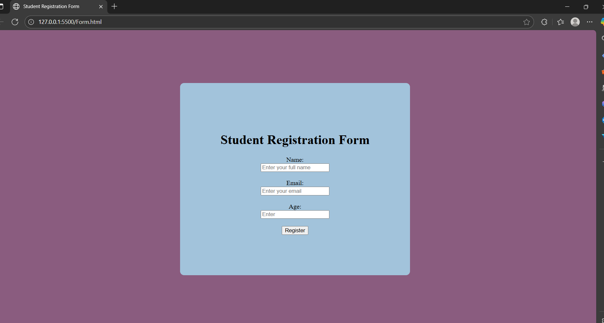

# Student Registration Form

This is a simple HTML-based **Student Registration Form**. The form collects basic details such as name, email, and age. It is styled using inline CSS to provide a centered and visually appealing layout.

##  Features

- Simple and responsive layout
- Collects Name, Email, and Age from the user
- Basic form validation using HTML5 attributes like `required` and input `type`
- Styled with inline CSS for demonstration

## Technologies Used

- HTML5
- Inline CSS

##  Screenshot

> Ensure `screenshot.png` is saved in the root directory of your project folder.

##  File Structure
student-form-practice-1/
│
├── Form.html
└── screenshot.png

##  How to Run

1. Download or clone the repository.
2. Open the `Form.html` file in any web browser.
3. Fill in the form fields and click "Register".

##  Contact

For suggestions or improvements, feel free to contribute or raise an issue.

---
